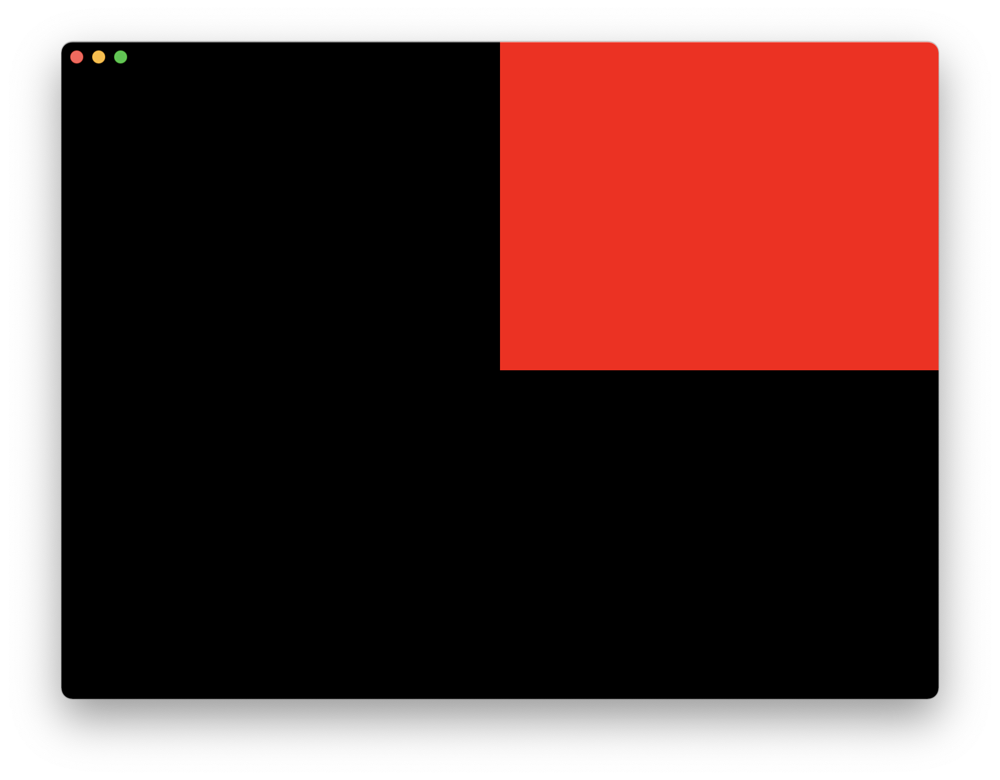
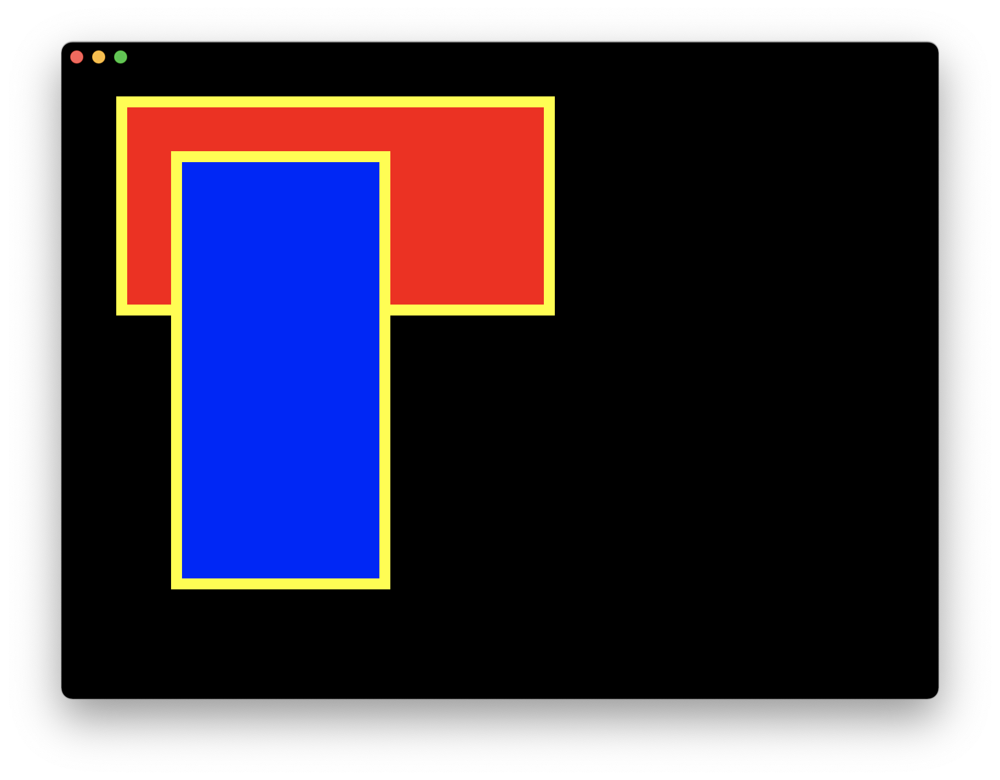

# Tutorial: Rendering 2D Shapes

Now that we've put [Hello World](./tutorial_hello_world.md) on the screen, let's draw some more interesting shapes.

## Step 1: Render colored rectangle

A shader is a type of program that runs on the GPU. Typically the process of rendering using shaders goes through multiple stages:
* Geometry Definition — defining the base geometry figure, which can be as simple as a rectangle or as complex as a teapot (which we'll look at in [Tutorial: Rendering 3D Meshes](./tutorial_rendering.md)).
* Vertex Shader — transforming the geometry's coordinates into screen coordinates.
* Rasterization — determining which pixels are inside the figure.
* Pixel Shader — computing the color of each pixel inside the rasterized figure.
* Instancing — repeat the above process for multiple instances of the same geometry, with some different instance-specific variables each time (like color or position).

See [Learn OpenGL](https://learnopengl.com/Getting-started/Hello-Triangle) for an example how this works in OpenGL.

Now let's go through the process of creating our own shader using Zaplib. First, write a function that builds a geometry:

```rust,noplayground
fn build_geom() -> Geometry {
    let vertex_attributes = vec![
        // top left vertex
        vec2(0., 0.),
        // top right vertex
        vec2(1., 0.),
        // bottom right vertex
        vec2(1., 1.),
        // bottom left vertex
        vec2(0., 1.),
    ];
    let indices = vec![
        // top-right triangle
        [0, 1, 2],
        // bottom-left triangle
        [2, 3, 0],
    ];
    Geometry::new(vertex_attributes, indices)
}
```

This function defines 2 adjacent triangles that form a rectangle.

Define a `SHADER` object:

```rust,noplayground
{{#include ../../examples/tutorial_2d_rendering/step1/src/main.rs:14:34}}
```
 - `code_to_concatenate` is the custom code assigned to the shader. We add `Cx::STD_SHADER` as a first argument which is a standard library of shaders within Zaplib.
 - `geometry` is a qualifier that defines the data passed from `build_geom` output. Since our `vertex_attributes` in `build_geom` consist of `Vec2` objects, we define it as such here.
 - `instance` is a qualifier that defines an instance-specific variable — more about that later.
 - `color` is used to define which color to use for rectangle.
 - `fn vertex()` defines the vertex shader. This gets called for each vertex returned from `build_geom`, with `geom` getting set to the corresponding point. It returns `vec4(x, y, z, w)` where the values mean the following:
   - `x, y` — coordinates on the screen (from -1 to 1).
   - `z` — draw order (from 0 to 1). Draws with higher `z` will be on top.
   - `w` — normalization parameter. Not very important for now, so we'll set it currently to 1.0.
 - `fn pixel()` defines the pixel shader. Since we are not drawing any special shapes yet, we'll set every pixel to the same color. The pixel shader is called once for each pixel in the output image.


Define the struct to pass the color into the shader as an instance variable:

```rust,noplayground
#[derive(Clone, Copy)]
#[repr(C)]
struct RectIns {
    color: Vec4,
}
```

Now we can combine all of this together and use the following `draw` function in our application:
```rust,noplayground
{{#include ../../examples/tutorial_2d_rendering/step1/src/main.rs:50:61}}
```
 - `let color` defines the red color.
 - `cx.add_instances` takes a shader and passes the `MyIns` data into it. Under the hood this creates a new "draw call".


You can run this full example with Cargo:

```bash
cargo run -p tutorial_2d_rendering_step1
```



Note: the coordinates of vertices returned from `vertex()` shader are in `[0; 1]` range, while the window canvas uses `[-1; 1]`. That's why we see a red rectangle covering only a quarter of the window. In the next section we'll see how to draw with pixel coordinates.

## Step 2: Render multiple bordered rectangles

Now let's modify our example to draw 2 bordered rectangles of the given sizes on top of each other.

Modify `RectIns` to include the top-left position of rectangle and its size:

```rust,noplayground
#[derive(Clone, Copy)]
#[repr(C)]
struct RectIns {
    color: Vec4,
    rect_pos: Vec2,
    rect_size: Vec2,
}
```


Update the shader code:

```rust,noplayground
{{#include ../../examples/tutorial_2d_rendering/step2/src/main.rs:21:42}}
```
 - `instance` variables `color`, `rect_pos`, `rect_size` define the data passed into the shader. They must be in the same order as the fields of the `RectIns` struct.
 - `varying pos` defines a local variable that gets passed from `vertex()` shader to the `pixel()` shader.
 - Inside `vertex()` we transform the geometry points to absolute coordinates of the rectangle to draw. In the end we apply `camera_projection` and `camera_view`, which are helper structs built into Zaplib that transform the absolute coordinates in pixels on the screen to `[-1; 1]` range.
 - Inside `pixel()` we define a 10 pixel border and return yellow for the pixels within that border, and `color` for other pixels in that rectangle.

 Finally, update the `draw` function to pass the new `RectIns` struct with new colors and positions of rectangles to draw:

 ```rust,noplayground
     fn draw(&mut self, cx: &mut Cx) {
        self.window.begin_window(cx);
        self.pass.begin_pass(cx, Vec4::color("0"));
        self.view.begin_view(cx, LayoutSize::FILL);

        let rect1 = RectIns { color: vec4(1., 0., 0., 1.), rect_pos: vec2(50., 50.), rect_size: vec2(400., 200.) };
        let rect2 = RectIns { color: vec4(0., 0., 1., 1.), rect_pos: vec2(100., 100.), rect_size: vec2(200., 400.) };

        cx.add_instances(&SHADER, &[rect1, rect2]);

        self.view.end_view(cx);
        self.pass.end_pass(cx);
        self.window.end_window(cx);
    }
```


You can run this full example with Cargo:

```bash
cargo run -p tutorial_2d_rendering_step2
```




## Step 3: Using `QuadIns`

Drawing rectangles is very common in graphics, so Zaplib provides a convenient `QuadIns` struct. Let's use it in our latest example.

Update the `SHADER` definition:

```rust,noplayground
static SHADER: Shader = Shader {
    build_geom: Some(QuadIns::build_geom),
    code_to_concatenate: &[
        Cx::STD_SHADER,
        QuadIns::SHADER,
        code_fragment!(
            r#"
            instance color: vec4;
            fn pixel() -> vec4 {
                let border = 10.;
                let pt = pos * rect_size;
                if pt.x < border || pt.y < border || pt.x > rect_size.x - border || pt.y > rect_size.y - border {
                    return vec4(1., 1., 0., 1.0);
                }
                return color;
            }
            "#
        ),
    ],
    ..Shader::DEFAULT
};
```
 - Pass in the `QuadIns::build_geom` function — it is identical to the `build_geom` function we defined above!
 - Prefix the shader with `QuadIns::SHADER`. This defines a `vertex()` shader, so we can remove that code.
 - We can remove `geom`, `rect_pos`, `rect_size`, and `pos`, since those are also defined inside `QuadIns::SHADER`.

Update `RectIns` to use `QuadIns` instead of `rect_pos` and `rect_size`:

```rust,noplayground
#[repr(C)]
struct RectIns {
    quad: QuadIns,
    color: Vec4,
}
```

We put `quad` on top to match the order in which shaders are concatenated above

Finally, change the `draw` function to pass new `RectIns` objects to the `add_instances` calls:

```rust,noplayground
{{#include ../../examples/tutorial_2d_rendering/step3/src/main.rs:46:65}}
```

You can run this full example with Cargo:

```bash
cargo run -p tutorial_2d_rendering_step3
```

The output hasn't changed:


This is what the full code looks like:

```rust,noplayground
{{#include ../../examples/tutorial_2d_rendering/step3/src/main.rs}}
```
