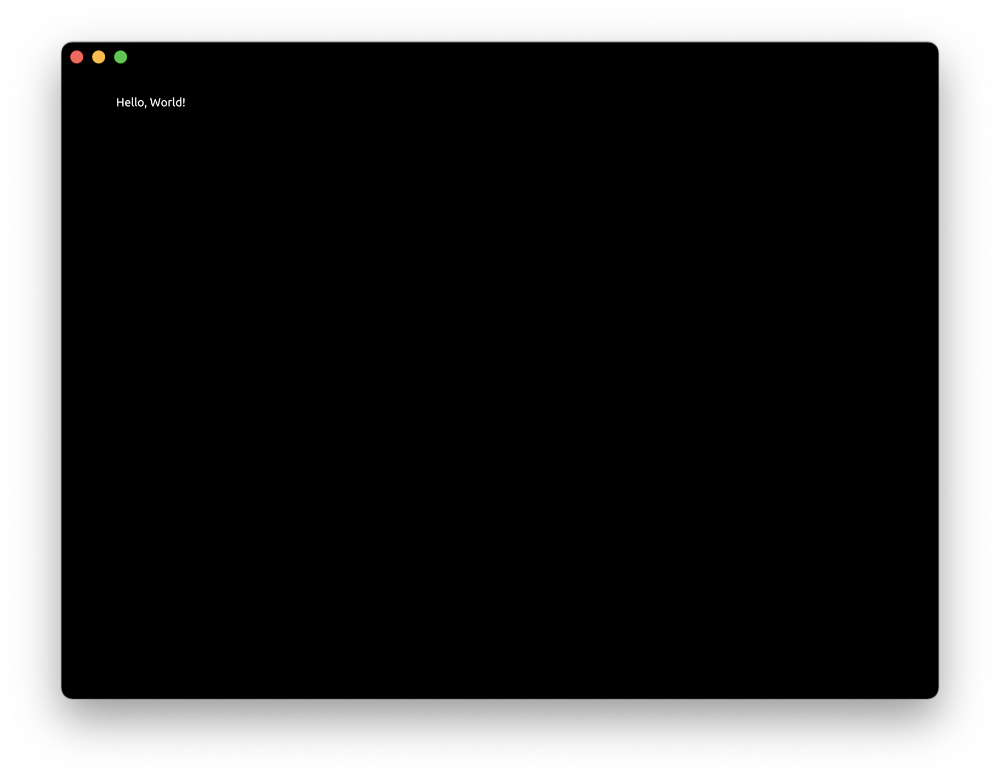

# Tutorial: Hello World Canvas

Let's build a simple Zaplib application that draws "Hello, World!" on the screen.

First we create a `Cargo.toml` file with the Zaplib dependency:
```toml
{{#include ../../examples/tutorial_hello_world_canvas/Cargo.toml}}
```

In `src/main.rs`, we need to define a main app to draw from:
```rust,noplayground
#[derive(Default)]
struct App {
}

impl App {
    fn new(cx: &mut Cx) -> Self {
        Self::default()
    }

    fn handle(&mut self, cx: &mut Cx, event: &mut Event) {
    }

    fn draw(&mut self, cx: &mut Cx) {
    }
}

main_app!(App);
```
Just like in [Tutorial: Hello World Console](./tutorial_hello_world_console.md), the `App` implements 3 main functions: `new`, `handle`, and `draw`. Next we create a window with some text in the `draw` function:

```rust,noplayground
{{#include ../../examples/tutorial_hello_world_canvas/src/main.rs:17:29}}
```
 * `window` refers to the main desktop or browser window.
 * `pass` refers to our rendering context. We specify a black background — we can use any hex color here.
 * `view` refers to our layout. We provide a `FILL` layout, which translates to 100% of the available width and height.
 * `begin_padding_box` adds a padding so that text doesn't overlap with the native window buttons.
 * `TextIns` is Zaplib's implementation for text rendering. We pass in our desired string and any formatting properties. We'll stick with default formatting for now.

Add the relevant state to `App`:
```rust,noplayground
{{#include ../../examples/tutorial_hello_world_canvas/src/main.rs:3:8}}
```

You can run this full example with Cargo:

```bash
cargo run -p tutorial_hello_world_canvas
```




Congratulations! You just did your first rendering in Zaplib. In the [next tutorial](./tutorial_2d_rendering.md) we will cover how to do 2D rendering.
