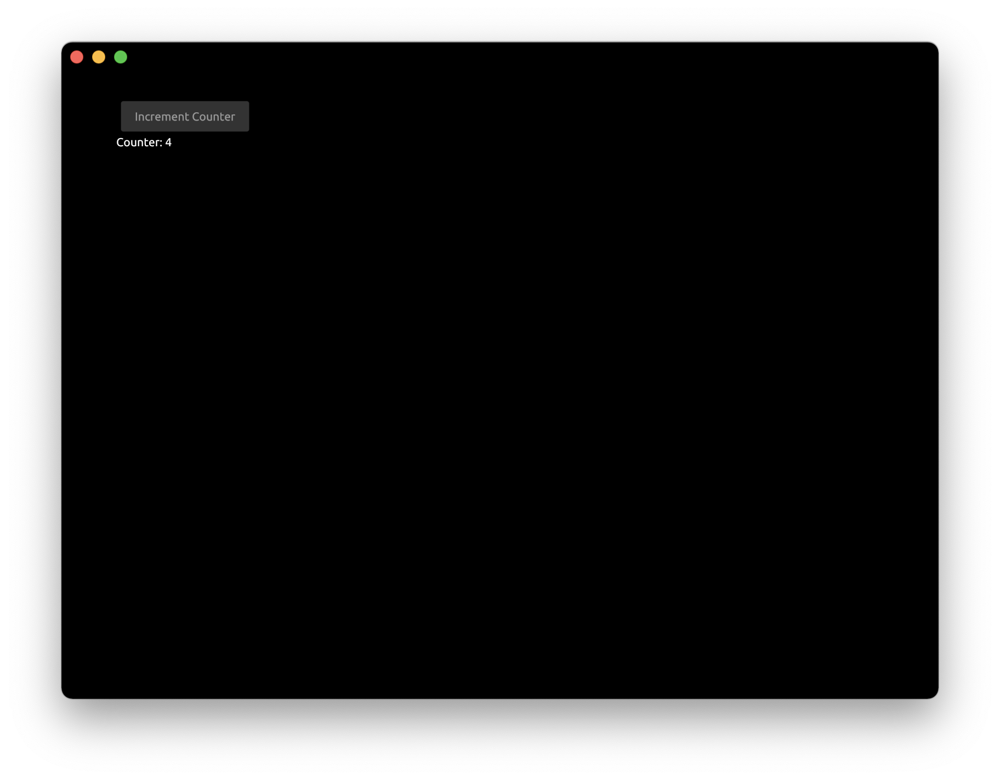
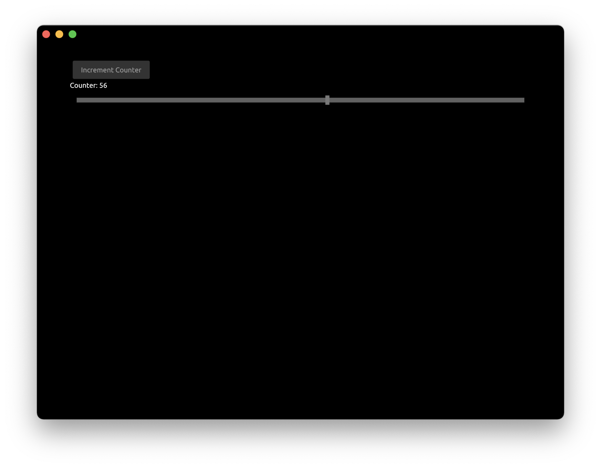
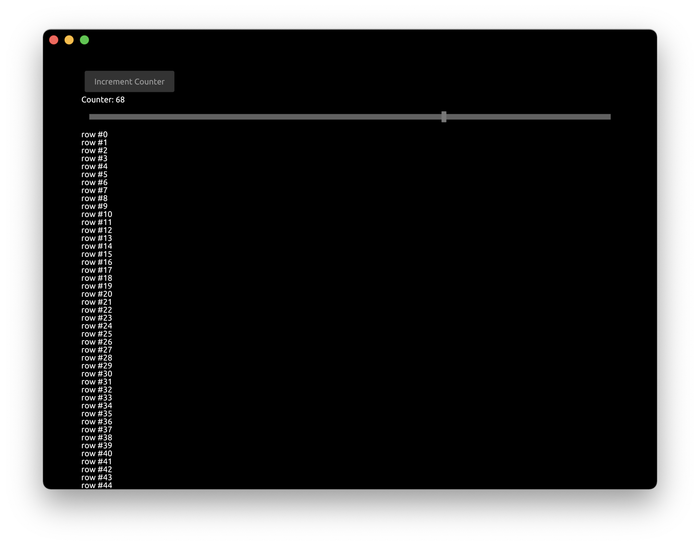
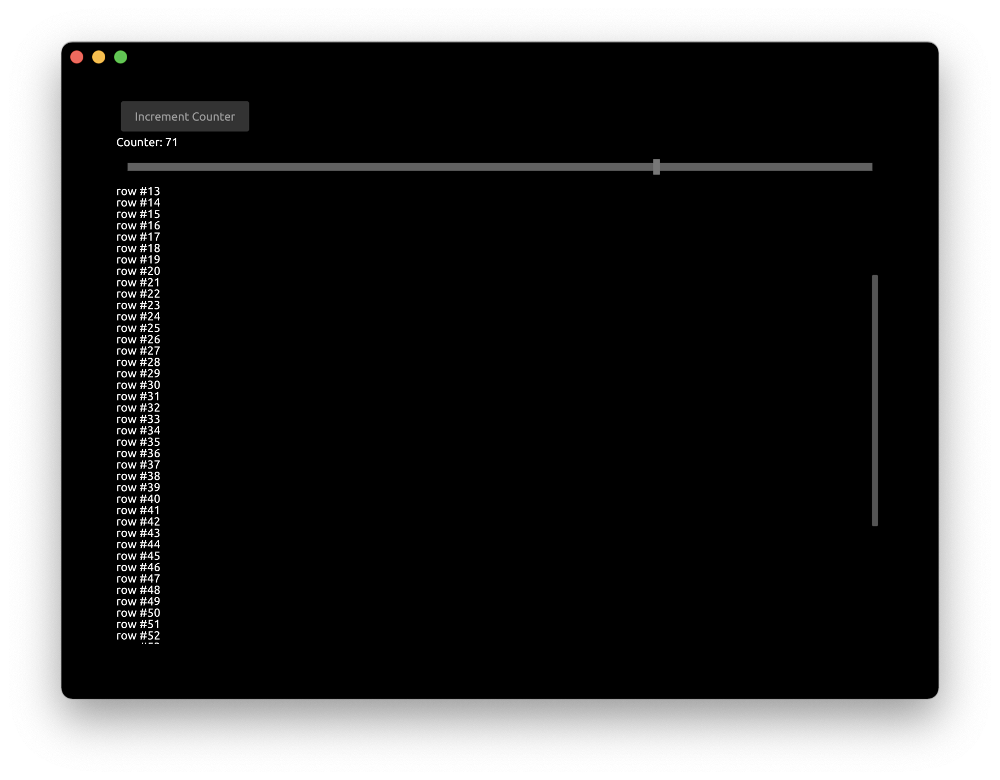

# Tutorial: UI Components

In this tutorial we will go through how to use some of the basic UI components provided by Zaplib:
 - [`Button`](#step-1-button)
 - [`FloatSlider`](#step-2-floatslider)
 - [`ScrollView`](#step-3-scrollview)


## Step 1: `Button`

Let's create button that would be simply incrementing a counter.


Create a `Cargo.toml` with `zaplib` and `zaplib_components` dependencies crates:

```toml
{{#include ../../examples/tutorial_ui_components/Cargo.toml}}
```

In `main.rs` include a library of components:

```rust,noplayground
use zaplib_components::*;
```

Add a button and a counter to `App` struct:

```rust,noplayground
#[derive(Default)]
struct App {
    window: Window,
    pass: Pass,
    view: View,
    button: Button,
    counter: i32,
}
```


Modify the `draw` function to draw the button and the value of the counter:

```rust,noplayground
    fn draw(&mut self, cx: &mut Cx) {
        self.window.begin_window(cx);
        self.pass.begin_pass(cx, Vec4::color("0"));
        self.view.begin_view(cx, LayoutSize::FILL);

        cx.begin_padding_box(Padding::vh(50., 50.));
        self.button.draw(cx, "Increment Counter");
        TextIns::draw_walk(cx, &format!("Counter: {}", self.counter), &TextInsProps::default());
        cx.end_padding_box();

        self.view.end_view(cx);
        self.pass.end_pass(cx);
        self.window.end_window(cx);
    }
```
 - `cx.begin_padding_box` adds the padding to application window
 - `button.draw` draws the button with the given label
 - `format!` creates the string with using `self.counter` value
 - `TextIns::draw_walk` draws the text on the screen

Modify the `handle` function to increment the counter when the button was pressed:

```rust,noplayground
    fn handle(&mut self, cx: &mut Cx, event: &mut Event) {
        if let ButtonEvent::Clicked = self.button.handle(cx, event) {
            self.counter += 1;
            cx.request_draw();
        }
    }
```
 - `button.handle` returns enum with possible events this component could trigger. We check if the button was clicked (`ButtonEvent::Clicked`). Other options are `ButtonEvent::Down`, `ButtonEvent::Up` and `ButtonEvent::None`.
 - `cx.request_draw()` is called to re-render the application window.


After pressing the button for a few times we can see the counter value changing:




## Step 2: `FloatSlider`

Now let's add the slider bar that would modify the same counter.

Add `FloatSlider` to `App` struct:

```rust,noplayground
struct App {
    // ...
    slider: FloatSlider,
}
```

Draw the slider inside `draw` function:

```rust,noplayground
        cx.begin_padding_box(Padding::vh(50., 50.));
        self.button.draw(cx, "Increment Counter");
        TextIns::draw_walk(cx, &format!("Counter: {}", self.counter), &TextInsProps::default());

        self.slider.draw(cx, self.counter as f32, 0., 100., Some(1.0), 1.0, None);
        cx.end_padding_box();
```
 - `slider.draw` draws the slider with current position at `self.counter` in a `0.` to `100.` range with step increments of `1.0`.

 Finally, connect the slider with the main application in `handle` function:
 
 ```rust,noplayground
    fn handle(&mut self, cx: &mut Cx, event: &mut Event) {
        // ...

        if let FloatSliderEvent::Change { scaled_value } = self.slider.handle(cx, event) {
            self.counter = scaled_value as i32;
            cx.request_draw();
        }
    }
 ```

Now we can see that counter value is controlled by both the button and the slider:


   

## Step 3: `ScrollView`

To illustrate the usage of `ScrollView` let's draw some long text on the screen. Modify the `draw` function to draw  rows equal to `self.counter` value:

```rust,noplayground
        cx.begin_padding_box(Padding::vh(50., 50.));
        self.button.draw(cx, "Increment Counter");
        TextIns::draw_walk(cx, &format!("Counter: {}", self.counter), &TextInsProps::default());

        self.slider.draw(cx, self.counter as f32, 0., 100., Some(1.0), 1.0, None);

        for value in 0..self.counter {
            TextIns::draw_walk(cx, &format!("row #{}", value), &TextInsProps::default());
        }

        cx.end_padding_box();
```

As we can see the rows went beyond the bounds of the application window:



Let's fix this by adding a `ScrollView` component.

Modify the `App` struct to include `ScrollView`

```rust,noplayground
struct App {
    // ...
    scroll_view: ScrollView,
}
```

Update the `App::new` constructor:

```rust,noplayground
    fn new(_cx: &mut Cx) -> Self {
        App {
            scroll_view: ScrollView::new_standard_vh(),
            ..Self::default()
        }
    }
```

In the `draw` function add `begin_view`  and `end_view` around the text drawing block

```rust,noplayground
        self.scroll_view.begin_view(cx, LayoutSize::FILL);
        for value in 0..self.counter {
            TextIns::draw_walk(cx, &format!("row #{}", value), &TextInsProps::default());
        }
        self.scroll_view.end_view(cx);
```

Finally, update the `handle` function to enable scrolling:

```rust,noplayground
    fn handle(&mut self, cx: &mut Cx, event: &mut Event) {
        // ...
        self.scroll_view.handle(cx, event);
    }
```
 - We are not modifying the internal `App`'s state on scroll events, so we just ignore the return value of `scroll_view.handle` call

You can run this full example with Cargo:

```bash
cargo run -p tutorial_ui_components
```


