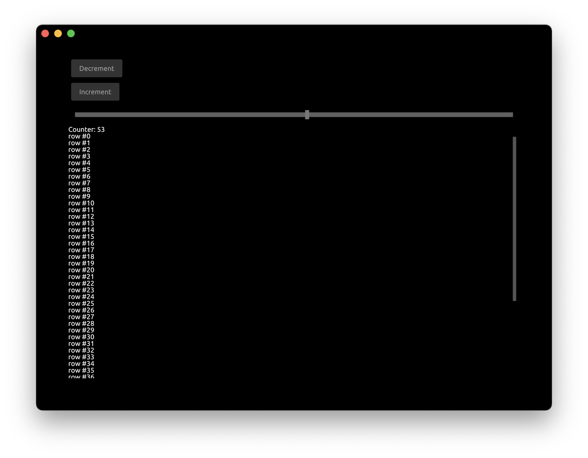
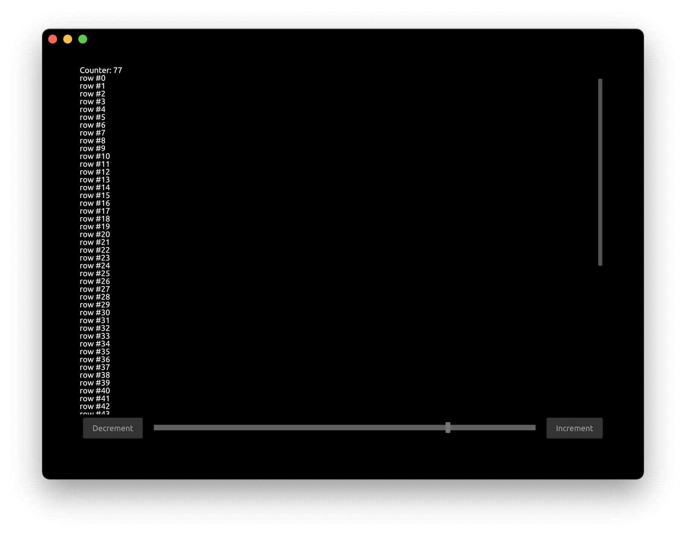
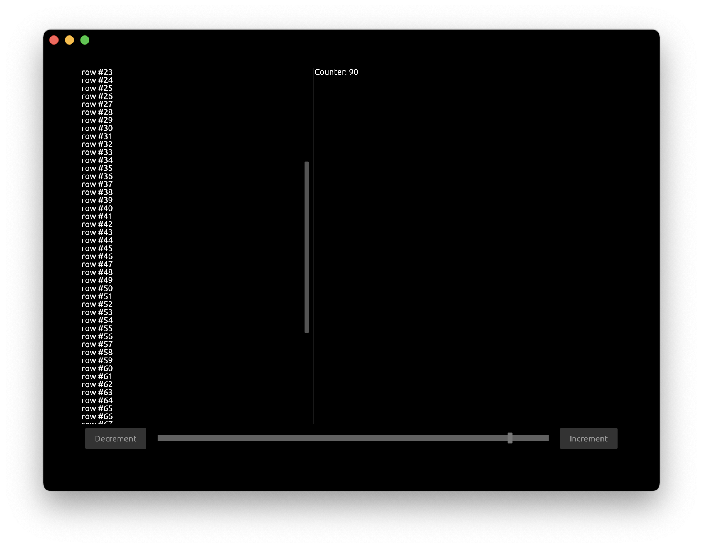

# Tutorial: UI Layout


This tutorial builds on top of the previous [UI Components](./tutorial_ui_components.md) tutorial, by modifying it. We will reorganize UI components on the screen using layouting system.

First, let's add another button to decrement the counter.

Update `App` struct:
```rust,noplayground
#[derive(Default)]
struct App {
    window: Window,
    pass: Pass,
    view: View,
    button_inc: Button,
    button_dec: Button,
    counter: i32,
    slider: FloatSlider,
    scroll_view: ScrollView,
}
```

Handle the clicks from the decrement button:
```rust,noplayground
    fn handle(&mut self, cx: &mut Cx, event: &mut Event) {
        if let ButtonEvent::Clicked = self.button_inc.handle(cx, event) {
            self.counter += 1;
            cx.request_draw();
        }
        if let ButtonEvent::Clicked = self.button_dec.handle(cx, event) {
            self.counter -= 1;
            cx.request_draw();
        }

        if let FloatSliderEvent::Change { scaled_value } = self.slider.handle(cx, event) {
            self.counter = scaled_value as i32;
            cx.request_draw();
        }

        self.scroll_view.handle(cx, event);
    }
```

Update the `draw` function to draw the decrement button:
```rust,noplayground
        cx.begin_padding_box(Padding::vh(50., 50.));
        
        self.button_dec.draw(cx, "Decrement");
        self.button_inc.draw(cx, "Increment");
        self.slider.draw(cx, self.counter as f32, 0., 100., Some(1.0), 1.0, None);    

        TextIns::draw_walk(cx, &format!("Counter: {}", self.counter), &TextInsProps::default());
        // ...
        cx.end_padding_box();
```




Now let's move these 2 buttons and a slider on the bottom of the app. We also want the buttons to be on the other sides of slider and slider spanning all space in the middle.

```rust,noplayground
        cx.begin_padding_box(Padding::vh(50., 50.));

        cx.begin_bottom_box();
        cx.begin_row(Width::Fill, Height::Compute);
        {
            self.button_dec.draw(cx, "Decrement");
            cx.begin_right_box();
            self.button_inc.draw(cx, "Increment");
            cx.end_right_box();
            self.slider.draw(cx, self.counter as f32, 0., 100., Some(1.0), 1.0, None);    
        }
        cx.end_row();
        cx.end_bottom_box();
        // ...
        cx.end_padding_box();
```

- `cx.begin_bottom_box` starts a block that would be aligned to the bottom of the screen
- `cx.begin_row` starts a container that draws components into a row. Arguments are the sizes of the container:
   - `Width::Fill` specifies to span the entire available width
   - `Height::Compute` specifies to use the height of underlying components
- Note we use curly braces to visually distinguish nested block of components
- `cx.begin_right_box` starts a block that would be aligned to the right of the screen
- `cx.end_right_box` ends corresponding right-aligned block
- `cx.end_row` ends corresponding row
- `cd.end_bottom_box` ends corresponding bottom-aligned block


The application now looks like this:




Now let's divide the text area into 2 parts and draw the text in each of them.

Add `Splitter` to `App` struct:
```rust,noplayground
struct App {
    // ...
    splitter: Splitter,
}
```

Set the initial state for `Splitter` inside `new` function:
```rust,noplayground
    fn new(_cx: &mut Cx) -> Self {
        let mut splitter = Splitter::default();
        splitter.set_splitter_state(SplitterAlign::First, 300., Axis::Vertical);
        App { scroll_view: ScrollView::new_standard_vh(), splitter, ..Self::default() }
    }
```
 - `Axis::Vertical` specifies that the orientation for divider
 - `300.` is the initial offset in pixels for divider

Update the `handle` function:

```rust,noplayground
    fn handle(&mut self, cx: &mut Cx, event: &mut Event) {
        // ...        
        self.splitter.handle(cx, event);
    }
```

Update the `draw` function to use the splitter:

```rust,noplayground
        cx.begin_row(Width::Fill, Height::Fill);
        {
            self.splitter.begin_draw(cx);
            {
                self.scroll_view.begin_view(cx, LayoutSize::FILL);
                cx.begin_column(Width::Compute, Height::Compute);

                for value in 0..self.counter {
                    TextIns::draw_walk(cx, &format!("row #{}", value), &TextInsProps::default());
                }
                cx.end_column();
                self.scroll_view.end_view(cx);
            }
            self.splitter.mid_draw(cx);
            {
                TextIns::draw_walk(cx, &format!("Counter: {}", self.counter), &TextInsProps::default());
            }
            self.splitter.end_draw(cx);
        }
        cx.end_row();
```
 - We need to enclose the splitter into `begin_row` as we want it to be drawn as a row
 - `splitter.begin_draw` starts the splitter block that would be drawn first
 - `splitter.mid_draw` start the splitter block that be drawn second
 - `splitter.end_draw` ends the splitter component


You can run this full example with Cargo:

```bash
cargo run -p tutorial_ui_layout
```


