# UI Components

| Component | Description |  |
|-----------|-------------|---------|
| [`Background`](/target/doc/zaplib_components/struct.Background.html) | Draws background of specified color | |
| [`Button`](/target/doc/zaplib_components/struct.Button.html) | Allows the user to take actions by clicking on it | [View](#button) |
| [`Chart`](/target/doc/zaplib_components/struct.Chart.html) | Draws charts with tooltips | [View](#chart)| 
| [`Checkbox`](/target/doc/zaplib_components/struct.Checkbox.html) | Allows the user to select/unselect specific items | [View](#checkbox) |
| [`DesktopWindow`](/target/doc/zaplib_components/struct.DesktopWindow.html) | Adds menu/top bar in a desktop application| |
| [`Dock`](/target/doc/zaplib_components/struct.Dock.html) | Provides a dock with tabs. Tabs could be dragged around or to split the screen| [View](#dock) |
| [`FloatSlider`](/target/doc/zaplib_components/struct.FloatSlider.html) | Allows the user to make selection from a range of values | [View](#floatslider) |
| [`FoldCaption`](/target/doc/zaplib_components/struct.FoldCaption.html) | Shows foldable content with a custom caption| [View](#foldcaption) |
| [`FpsCounter`](/target/doc/zaplib_components/struct.FpsCounter.html) | Displays the current frame rate| [View](#fpscounter)|
| [`Popover`](/target/doc/zaplib_components/struct.Popover.html) | Shows an overlay with custom content | [View](#popover)|
| [`ScrollView`](/target/doc/zaplib_components/struct.ScrollView.html) | Adds horizontal and/or vertical scroll for content that doesn't fit on the screen| |
| [`Splitter`](/target/doc/zaplib_components/struct.Splitter.html) | Splits the screen horizontally or vertically with draggable divider in between| [View](#splitter) |
| [`TextEditor`](/target/doc/zaplib_components/struct.TextEditor.html) | Displays editable multi-line text with line numbers and syntax highlighting | [View](#texteditor) |
| [`TextInput`](/target/doc/zaplib_components/struct.TextInput.html) | Allows the user to enter and edit text | [View](#textinput)|
| [`Viewport3D`](/target/doc/zaplib_components/struct.Viewport3D.html) | Shows 3D rendered scene that could be moved and rotated| [View](#viewport3d) |

## Gallery

### Button

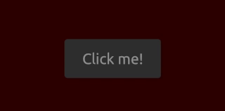

### Chart

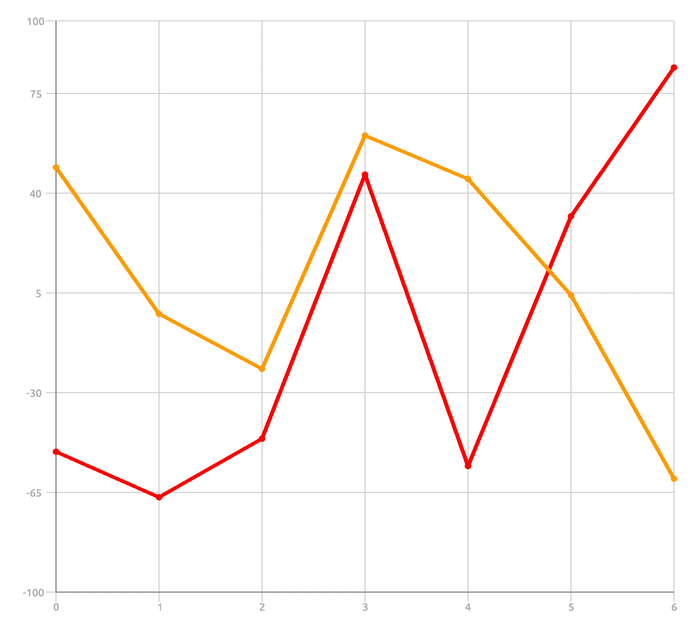

### Checkbox

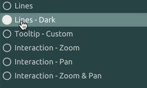

### Dock

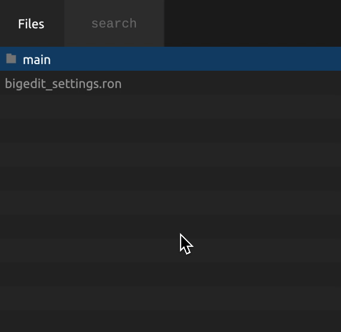

### FloatSlider

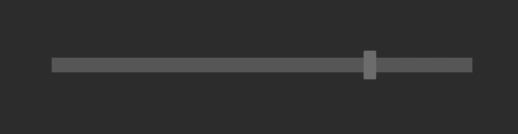

### FoldCaption

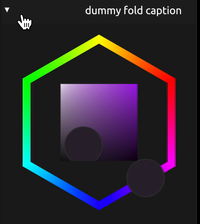

### FpsCounter

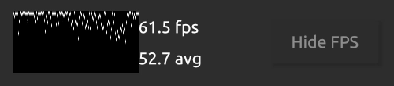

### Popover

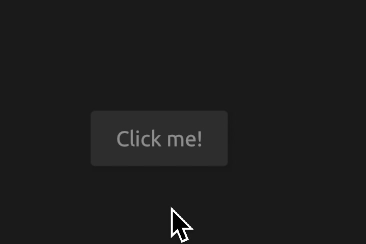

### Splitter

### TextEditor

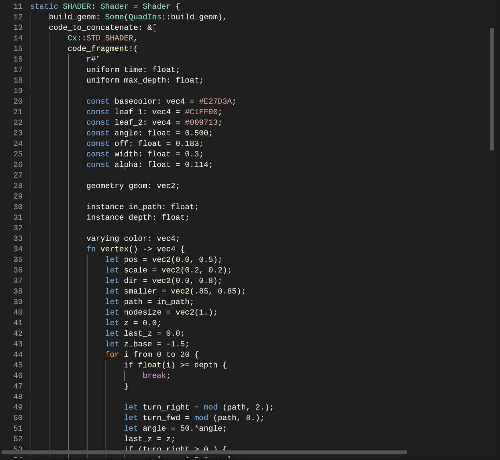

### TextInput

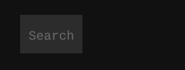

### Viewport3D

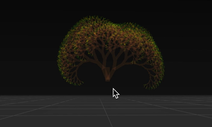
